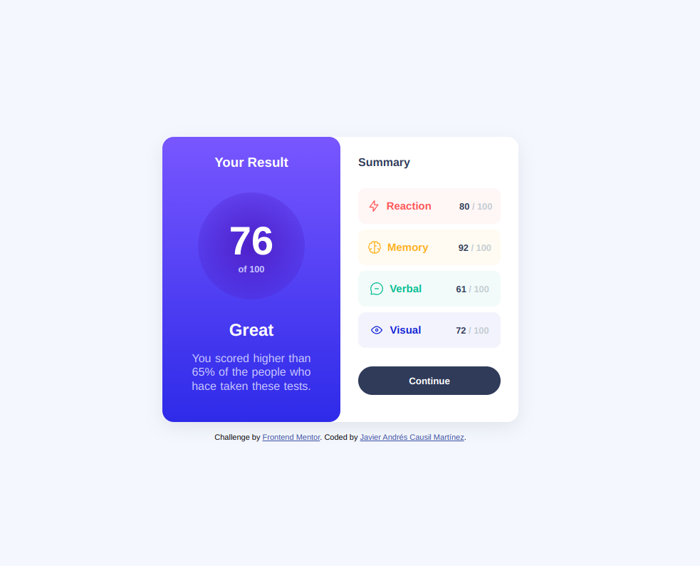

# Frontend Mentor - Results summary component solution

This is a solution to the [Results summary component challenge on Frontend Mentor](https://www.frontendmentor.io/challenges/results-summary-component-CE_K6s0maV). Frontend Mentor challenges help you improve your coding skills by building realistic projects. 

## Table of contents

- [Overview](#overview)
  - [The challenge](#the-challenge)
  - [Screenshot](#screenshot)
  - [Links](#links)
- [My process](#my-process)
  - [Built with](#built-with)
  - [What I learned](#what-i-learned)
  - [Continued development](#continued-development)
  - [Useful resources](#useful-resources)
- [Author](#author)
- [Acknowledgments](#acknowledgments)

**Note: Delete this note and update the table of contents based on what sections you keep.**

## Overview

### The challenge

Users should be able to:

- View the optimal layout for the interface depending on their device's screen size
- See hover and focus states for all interactive elements on the page
- **Bonus**: Use the local JSON data to dynamically populate the content

### Screenshot

### Links

- Solution URL: [Add solution URL here](https://github.com/eurekaInfinity/challengefrontend/tree/main/frontMaster/results-summary-component-main)
- Live Site URL: [Add live site URL here](https://eurekainfinity.github.io/challengefrontend/frontMaster/results-summary-component-main/index)

## My process

### Built with

- Semantic HTML5 markup
- CSS custom properties
- Flexbox
- CSS Grid
- Mobile-first workflow

### What I learned

"I learned how to call .json files in my .js files. I tried to distribute responsibilities in the classes to invoke them in the attributes of the HTML tags and avoid repeating styles. I liked it a lot and we are going for it. Thank you for reading this, let's go all out."

### Continued development

I learned how to call .json files in my .js files.

### Useful resources

- [json](https://v8.dev/features/import-assertions) - This helped me for XYZ reason. I really liked this pattern and will use it going forward.
- [json](https://developer.mozilla.org/en-US/docs/Web/HTML/Element/script#module_fallback) - 

## Author

- Frontend Mentor - [@yourusername](https://www.frontendmentor.io/profile/Causil)

